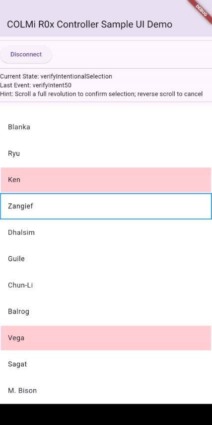
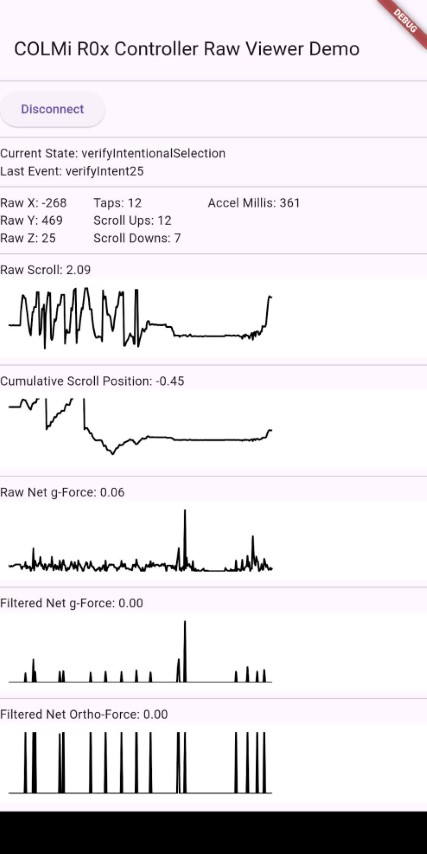

# colmi_r0x_controller

COLMi R02-R06 (BlueX RF03 SoC) Ring-as-Controller

_(Please note that some R02 rings may contain other SoCs and firmware and will not be compatible.)_
- Scroll and Tap to select
- Uses Flutter Blue Plus for Bluetooth LE connectivity
- Built for Android and iOS but only tested on Android
- Scroll position is surprisingly reliable, false positive and false negative taps are trickier and require more experimentation

### Example apps

### Demo videos

### Controller Interaction Model:
 - Wave gesture to wake
 - Perform a full rotation Scroll Up to confirm Wakeup (or flip the ring around if it's scrolling down)
 - Once confirmed, ring is in the User Input state and should recognise Scroll Up, Scroll Down and (tap to) Select
 - (Taps can be missed when accelerometer is only sampled every 250ms, so tap hard and tap often. 30ms sampling should be happening on Android.)
 - Perform a full rotation Scroll Up to confirm the Select command
 - If confirmation rotation for Wakeup or Select is too slow, it times out back to Idle or User Input states respectively
 - Down scrolling while in the Verify Wakeup or Verify Selction state cancels the verification back to Idle and User Input states respectively.
