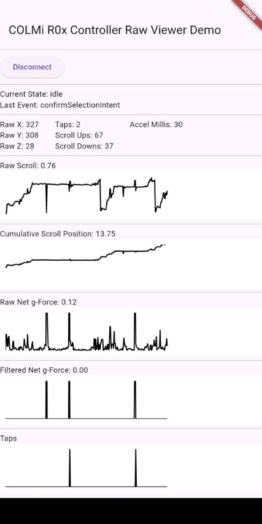

# colmi_r0x_controller_raw_viewer

### COLMi R0x Controller Raw Viewer Demo

(Built for Android and iOS but only Android has been tested.)

### Screenshot

### Controller Interaction Model:
 - Wave gesture to wake
 - Perform a full rotation Scroll Up to confirm Wakeup (or flip the ring around if it's scrolling down)
 - Once confirmed, ring is in User Input mode and should recognise Scroll Up, Scroll Down and (tap to) Select
 - (Taps can be missed when accelerometer is only sampled every 250ms, so tap hard and tap often)
 - Perform a full rotation Scroll Up to confirm the Select command
 - If confirmation rotation for Wakeup or Select is too slow, it times out back to Idle or User Input modes respectively

 ### Raw Viewer:
 - Automatically attempts to find and connect to Colmi R0x (R02-R06) ring
 - Shows live accelerometer readings from the ring on oscilloscope displays (during verification, user input)
